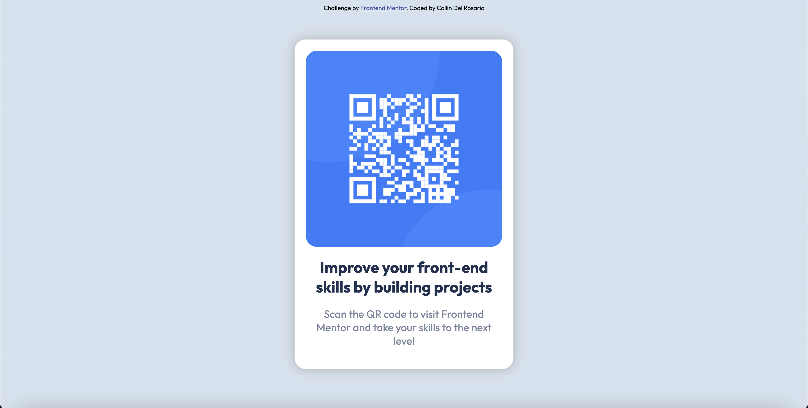

# Frontend Mentor - QR code component solution

This is a solution to the [QR code component challenge on Frontend Mentor](https://www.frontendmentor.io/challenges/qr-code-component-iux_sIO_H). Frontend Mentor challenges help you improve your coding skills by building realistic projects.

## Table of contents

- [Overview](#overview)
  - [Screenshot](#screenshot)
  - [Links](#links)
- [My process](#my-process)
  - [Built with](#built-with)
  - [What I learned](#what-i-learned)
  - [Continued development](#continued-development)
  - [Useful resources](#useful-resources)
- [Author](#author)

**Note: Delete this note and update the table of contents based on what sections you keep.**

## Overview

### Screenshot



### Links

- Solution URL: [Add solution URL here](https://github.com/delroscol98/qr-code)
- Live Site URL: [Add live site URL here](delroscol98.github.io/qr-code/)

## My process

1. Identify the layers of the design (window -> main container -> QR code + text content)
2. Build the HTML without semantic tags
3. Style the HTML according to the design
4. Convert HTML tags to semantic tags

### Built with

- Semantic HTML5 markup
- CSS custom properties

### What I learned

This was my first introduction to Frontend Mentor and I love it. For too long I've been stuck in tutorial hell and this was my first time building a design without assistance.

Below are some code snippets I'm proud of:

```html
<main class="container">
  <figure class="qr-container"></figure>
  <article class="text-container">
    <h1>Improve your front-end skills by building projects</h1>
    <p>
      Scan the QR code to visit Frontend Mentor and take your skills to the
      next level
    </p>
  </div>
</main>
```

```css
.qr-container {
  background-image: url(./images/image-qr-code.png);
  background-position: center;
  background-size: cover;
  height: 350px;
  border-radius: 20px;
}
```

### Continued development

Upon reflection, I should be more conscious of Semantic HTML tags and implement them as I build the project. I should also remember to identify the layers of the project, this could be done by annotating the design with the tags that ought to be used.

### Useful resources

- [Semrush Blog](https://www.semrush.com/blog/semantic-html5-guide/?kw=&cmp=AU_SRCH_DSA_Blog_EN&label=dsa_pagefeed&Network=g&Device=c&utm_content=676601314943&kwid=dsa-2185834090056&cmpid=18368690804&agpid=155244529660&BU=Core&extid=105281796899&adpos=&gad_source=1&gclid=Cj0KCQiAmNeqBhD4ARIsADsYfTfUJmrdCB1l80RhFitR520CR9wF1ljunFLV3_uJkAn1j7UAnzFqUTEaAn02EALw_wcB) - This helped me understand Semantic HTML.

## Author

- Frontend Mentor - [@delroscol98](https://www.frontendmentor.io/profile/yourusername)
